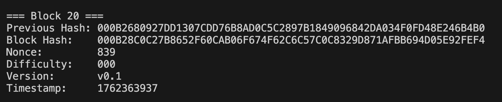
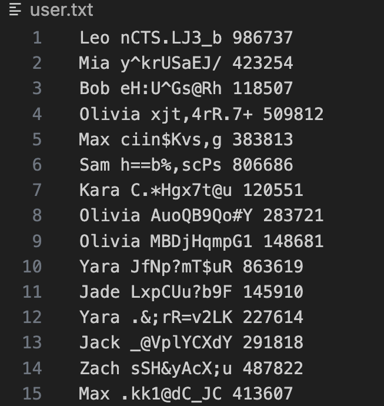
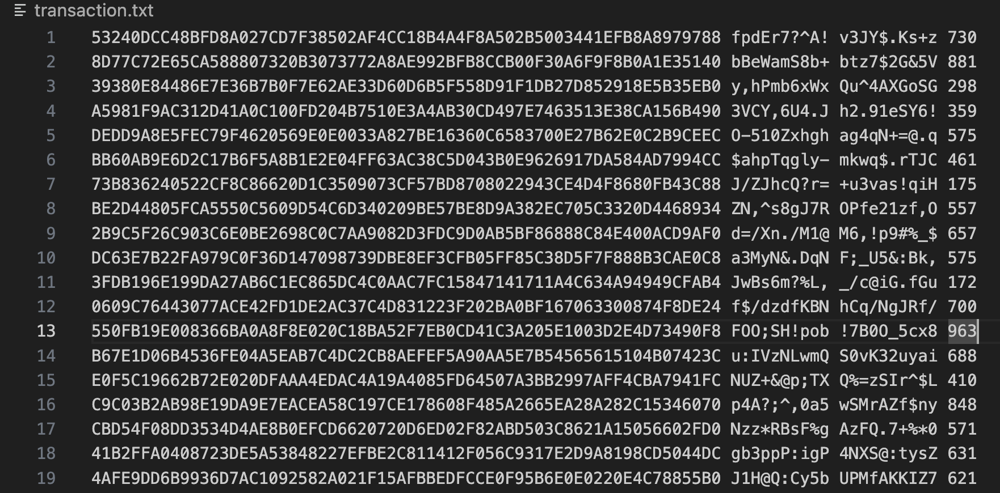
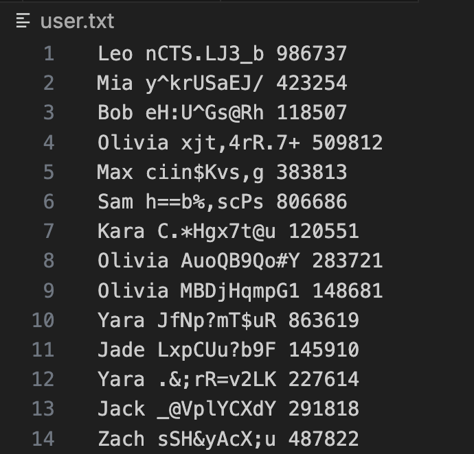

Kaip naudotis programa?
į konsolę parašyti - make
tuomet sukompiliavus konsolėje parašyti - ./blockchain, tai paleis kodą.

User klasė  
Saugo informaciją apie vartotoją: vardą, viešą raktą (publicKey) ir balansą.

Transaction klasė 
Aprašo vieną transakcijas: ID, siuntėją, gavėją, sumą.
ID yra hash’as, apskaičiuotas iš siuntėjo, gavėjo ir sumos.

Hasher klasė 
Atsakinga už hash’ų skaičiavimą.
Metodai: 
computeHash() – paskaičiuoja bloko hash.

Block klasė saugo: 
previousHash, timestamp, merkleRootHash, version difficulty, nonce, blockHash.
body – transakcijų sąrašą.
Metodai: 
bodyTransactions(...) – atrenka 100 išmaišytų transakciju, patikrina ar sutampa transakciju ID, atnaujina user balansus, sudeda body vektorių. 
setHeader(...) - iš sugeneruotų 100 transakcijų sukuria merkleRootHash ir timestamp  
calculateHash(...) - skaičiuoja kasamo bloko hash'a 
calculateMerkleRoot(...) - iš 100 transakcijų id poromis atrenka transakcijas, iš jų padaro vieną hash ir taip kartoja kol lieka vienas hashas. 
mineBlock(...) – ieško nonce, kad hash atitiktų difficulty.

Blockchain klasė 
Laiko visą blokų grandinę (vector<Block> chain).
Prideda naujus blokus.
metodai: 
Blockchain(...) - konstruktorius, sukonstruoja genesis bloka. 
addBlock(...) -  sukuria 5 kandidatinius blokus, kuriuos lygegriačiai kasa, o po to prideda į blockchain su mažiausiu nonce. 
printChain(...) - atspausdina visus iškastus blokus į konsolę 

main.cpp 
vykdo vartotojų ir transakcijų generavimą.
Inicijuoja blockchain’ą.

Programos eiga nuo pradžios iki galo:

1. Iš users.txt sukuriami User objektai: vardas, publicKey, balansas 

2. Iš transactions.txt sukuriamos Transaction struktūros su ID, siuntėju, gavėju, suma. 

3. Sukuriamas genesis blokas iš tuščių transakcijų. 

Po to vyksta blokų paruošimas pridėti juos į blockchaina, kol nebeliks transakcijų: 

4. Iš pradžių gauname praeito bloko hash. 

5. Sugneruojame 5 kandidatinius blokus. 

6. Sudedam juos į fiveCadidates vektorių. 

7. Paraleliai kasam visus 5 blokus. 

8. Jei nors vienas blokas iškastas, pridedam jį i blockchain, jei yra daugiau blokų, pridedam, kurio nonce mažiausias. 

9. Spausdinam iškastus blokus į konsolę. 

Konsolėje parodoma: 

 
=== Block 3 === 
Previous Hash: 000B2680927DD... 
Block Hash:    000B28C0C27B8... 
Nonce:         512 
Difficulty:    000 
Version:       v0.1 
Timestamp:     1762360054 
Tai reiškia: 
Blokas Nr. 20 buvo sukurtas. 
Ankstesnio bloko hash. 
Bloko hash. 
Nonce buvo rastas 512‑uoju bandymu. 
Sunkumas - Bloko hash prasideda ("000"). 
Bloko versija.  
Timestamp rodo Unix laiką, kada blokas buvo sugeneruotas.

Sugeneruotų vartotojų vardas, public key ir balansas:  
  

Sugeneruotų transakcijų ID, siuntejo, gavejo raktai, siunčiama suma. 
 

Vartotojų balansai po patvirtintų transakcijų 
